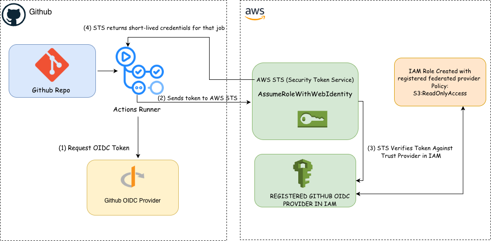

# aws-oidc

This repo contains a working demo of using GitHub Actions to assume an IAM role in AWS with read-only access using
OpenID Connect. With OIDC, no static keys are stored in the repository. Instead, short-lived credentials are issued for every
job, scoped to the repository and optionally scoped to specific branches.

To set up OIDC for GitHub and AWS please see my full
article on [LinkedIn](https://www.linkedin.com/pulse/how-use-oidc-give-github-actions-secure-access-aws-tobiloba-ogundiyan-hrw1e/?trackingId=bGzfXxEpRn695y3XauEg2Q%3D%3D).

To see the workflow in action.please proceed to the actions tab and trigger the manual workflow. inspect the logs and observe the Auth process.

## Architecture

